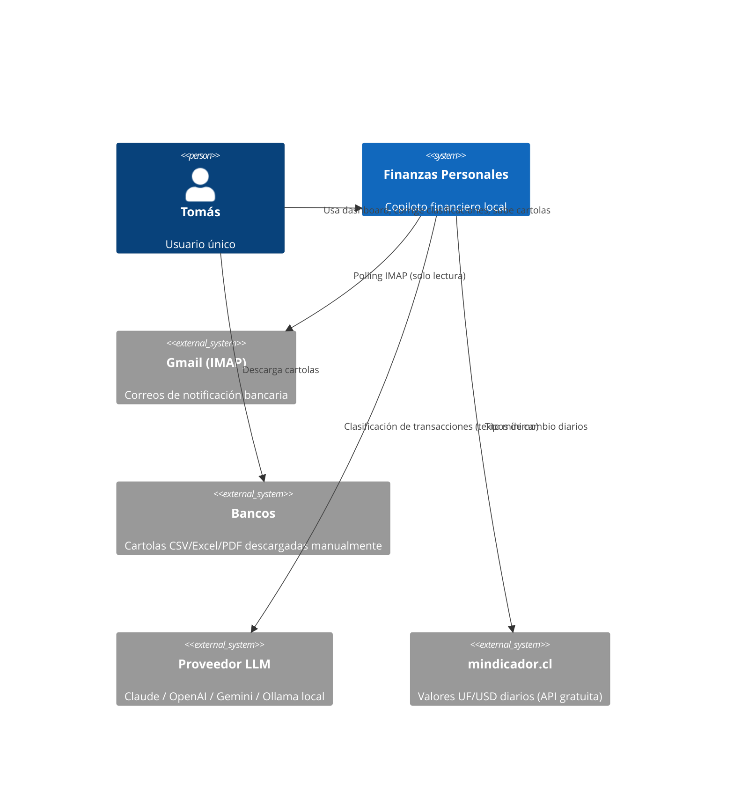

# 02 — Arquitectura General

> Estado: **Aprobado** · Última actualización: 2026-07-06
> Decisiones formales en `docs/adr/`. Este documento describe; los ADR justifican.

## 1. Decisión central: monolito modular

Un solo proceso backend (FastAPI) con módulos internos de frontera estricta, más un
proceso de dashboard (Streamlit) y un scheduler de jobs. **No** microservicios, **no**
n8n, **no** colas de mensajes en el MVP. Justificación en [ADR-001](adr/ADR-001-monolito-modular.md)
y [ADR-005](adr/ADR-005-scheduler-python-no-n8n.md).

Regla de oro: los módulos se comunican solo por interfaces definidas en `core`.
Si mañana un módulo debe volverse servicio (ej: workers en un VPS), la frontera ya existe.

## 2. C4 — Nivel 1: Contexto



## 3. C4 — Nivel 2: Contenedores (docker compose)

| Contenedor | Tecnología | Responsabilidad | Puerto |
|---|---|---|---|
| `api` | FastAPI + Uvicorn | API REST, orquestación de importación y clasificación | 8000 (localhost) |
| `dashboard` | Streamlit | UI: dashboard, cola de revisión, carga de cartolas | 8501 (localhost) |
| `worker` | Python + APScheduler | Jobs: polling IMAP, clasificación batch, tipos de cambio, backups | — |
| `db` | PostgreSQL 16 | Única fuente de verdad | 5432 (solo red interna) |

Notas de frontera:
- `dashboard` habla **solo** con `api` (HTTP). Nunca accede a la DB directo. Esto
  mantiene una sola capa de lógica de negocio y hace trivial reemplazar Streamlit después.
- `api` y `worker` comparten el paquete `core` (misma imagen, distinto entrypoint).
- Puertos ligados a `127.0.0.1`, nunca expuestos a la red.

## 4. C4 — Nivel 3: Componentes del backend

```
core/                    ← dominio puro. Sin FastAPI, sin SQL crudo, sin HTTP.
  models/                  entidades (SQLAlchemy) y esquemas (Pydantic)
  services/                casos de uso: ImportService, ClassificationService,
                           ReconciliationService, ReportingService
  repositories/            acceso a datos (patrón Repository sobre SQLAlchemy)
connectors/              ← ingesta. Cada conector implementa la interfaz Connector.
  base.py                  Connector (ABC): fetch() -> list[RawTransaction]
  email_imap/              polling + parsers por banco/plantilla
  statement_files/         parsers de cartola CSV/XLSX/PDF por banco
ai/                      ← inteligencia. Interfaz LLMProvider (ver docs/04).
  providers/               claude.py, openai.py, gemini.py, ollama.py
  classification/          pipeline reglas → LLM → cola de revisión
api/                     ← capa HTTP delgada. Routers llaman a core.services.
workers/                 ← jobs programados. Llaman a core.services. Sin lógica propia.
shared/                  ← config (pydantic-settings), logging, errores, utilidades
```

Dependencias permitidas (unidireccionales):
`api → core ← workers` · `core → connectors (vía interfaz)` · `core → ai (vía interfaz)` · todos → `shared`.
`connectors` y `ai` **no** conocen a `core.services` ni entre sí.

## 5. Flujos principales

### F1 — Importación de cartola (fuente oficial)
1. Usuario sube archivo en dashboard → `POST /imports` con archivo + cuenta.
2. `ImportService` crea `ImportBatch`, detecta banco/formato, invoca parser.
3. Parser produce `RawTransaction[]` normalizadas (fecha, monto, moneda, descripción, hash).
4. Deduplicación por hash + reconciliación contra transacciones provisorias de email (docs/03 §5).
5. Transacciones nuevas quedan sin categoría (`category_id = null`), a la espera del pipeline de clasificación (F3). Batch queda auditado (filas leídas/insertadas/duplicadas/reconciliadas).

### F2 — Ingesta por correo (señal temprana)
1. Worker hace polling IMAP (al arrancar y cada 15 min con PC encendido).
2. Parser por plantilla de banco extrae monto/comercio/fecha → transacción **provisoria** (`source=email`, `status=provisional`).
3. Al llegar la cartola, la reconciliación la confirma o la marca huérfana para revisión.

### F3 — Clasificación
1. Reglas deterministas del usuario primero (comercio→categoría). Si matchea, listo (costo $0).
2. Si no: LLM con contexto de correcciones previas similares (few-shot). Respuesta: categoría + confianza.
3. Confianza ≥ umbral → auto-clasificada (`by=ai`). Bajo umbral → cola de revisión.
4. Corrección del usuario → nueva decisión en `classification_decisions` (ADR-008) → puede promoverse a regla (docs/04 §5).

### F4 — Job diario (worker)
Tipos de cambio UF/USD → polling email → clasificación batch → backup (docs/06).

## 6. Estructura del repositorio

```
finanzas-personales/
├── MASTER_PROJECT.md          # memoria viva del proyecto
├── README.md
├── docker-compose.yml
├── .env.example               # plantilla; .env real NUNCA en git
├── .gitignore                 # incluye .env, logs/, backups/, data/
├── pyproject.toml             # deps + ruff + mypy + pytest config
├── docs/
│   ├── 01..09-*.md
│   └── adr/ADR-NNN-*.md
├── src/finanzas/
│   ├── core/      (models, services, repositories)
│   ├── connectors/(base, email_imap/, statement_files/)
│   ├── ai/        (providers/, classification/)
│   ├── api/       (main.py, routers/, deps.py)
│   ├── workers/   (scheduler.py, jobs/)
│   ├── dashboard/ (app.py, pages/, api_client.py)
│   └── shared/    (config.py, logging.py, errors.py)
├── migrations/                # Alembic
├── tests/                     # espeja src/; fixtures/ con cartolas y correos anonimizados
├── scripts/                   # backup.sh, restore.sh, dev-setup
└── docker/                    # Dockerfiles
```

Correcciones deliberadas al listado original solicitado:
- `logs/` y `backups/` **no** se versionan en git: son artefactos de runtime (volúmenes
  Docker, gitignorados). Versionarlos es mala práctica (secretos, ruido, tamaño).
- `ia` → `src/finanzas/ai/`; `database` → `migrations/` + `core/models`; `automation`
  → `workers/` (n8n diferido, ADR-005). Mismo contenido, ubicación correcta en un monolito modular.

## 7. Revisión crítica de esta arquitectura

- **Riesgo:** Streamlit vía API agrega latencia y trabajo (endpoints antes que pantallas).
  Se acepta: el costo de acoplar UI a la DB sería mayor al reemplazar la UI (probable a mediano plazo).
- **Limitación:** sin cola de mensajes, un job pesado bloquea al worker. Aceptable mono-usuario;
  si duele, APScheduler → arq/Redis es un cambio localizado en `workers/`.
- **Caso borde:** dos importaciones simultáneas de la misma cartola → resuelto con idempotencia
  por hash y constraint de unicidad en DB, no con locks de aplicación.
- **Mejora futura:** extraer `connectors` a plugins instalables si aparecen >5 bancos.
