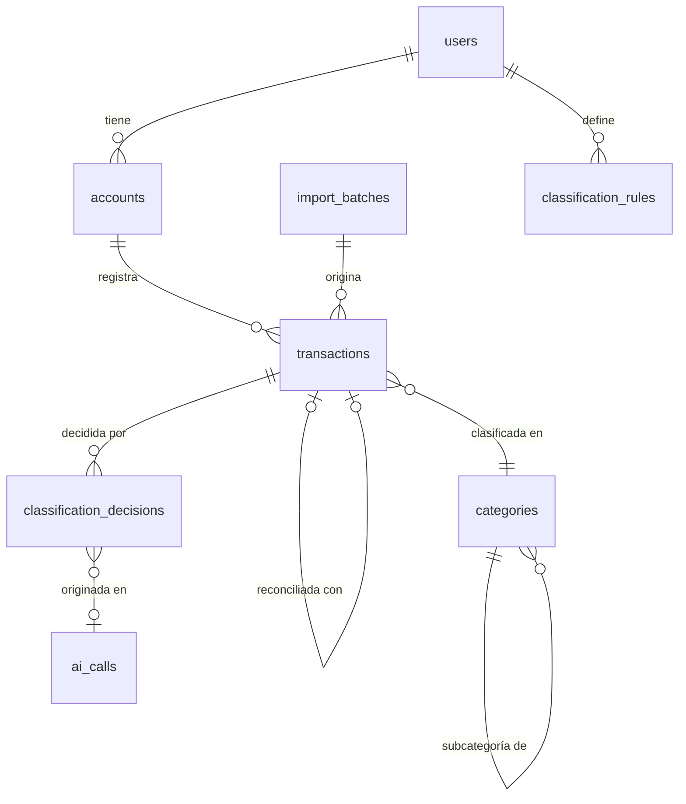

# 03 — Modelo de Dominio y de Datos

> Estado: **Aprobado** · Última actualización: 2026-07-06
> Motor: PostgreSQL 16 · Migraciones: Alembic · ORM: SQLAlchemy 2.x (tipado)

## 1. Principios

1. **La cartola es la fuente de verdad.** El correo es señal temprana provisoria.
2. **Nada se borra.** Correcciones y reconciliaciones se registran; soft-delete donde aplique.
3. **Idempotencia.** Reimportar el mismo archivo N veces produce el mismo estado.
4. **`user_id` en toda tabla de datos de usuario desde el día 1** (ADR-002). En el MVP
   existe un solo registro en `users`; ningún código asume que sea el único.
5. **Montos como `NUMERIC(18,4)`**, jamás float. CLP usa 0 decimales, USD 2, UF 4 —
   la precisión de despliegue es responsabilidad de la capa de presentación.

## 2. Modelo de dominio (entidades y relaciones)



## 3. Tablas del MVP

### users
`id (uuid pk)`, `email`, `display_name`, `created_at`. Sin password en MVP (sin login;
sistema local). La columna existe para que Fase 7 agregue auth sin migrar datos.

### accounts
`id`, `user_id fk`, `name`, `bank (enum abierto)`, `type (checking|credit_card|savings|credit_line|cash)`,
`currency (CLP|UF|USD)`, `last4`, `is_active`, `created_at`.
Nota: el saldo NO se almacena como campo mutable; se deriva de transacciones + saldo
inicial (`opening_balance`, `opening_date`). Evita el clásico bug de saldo desincronizado.

### transactions — tabla central
| Columna | Tipo | Nota |
|---|---|---|
| id | uuid pk | |
| user_id, account_id | fk | |
| posted_at | date | fecha contable (cartola) |
| occurred_at | timestamptz null | fecha real si se conoce (email) |
| amount | numeric(18,4) | negativo = cargo, positivo = abono |
| currency | char(3) | moneda de la transacción |
| description_raw | text | texto original inmutable de la fuente |
| description_norm | text | normalizada (mayúsculas, sin códigos de sucursal) |
| merchant | text null | comercio extraído |
| category_id | fk null | |
| classified_by | enum: rule, ai, user, null | **estado actual denormalizado**; el historial completo vive en `classification_decisions` (ADR-008) |
| classification_confidence | numeric(3,2) null | ídem: copia del `is_current` |
| status | enum: provisional, confirmed, reconciled, orphan | ciclo de vida (§5) |
| source | enum: email, statement, manual | |
| source_ref | text | msg-id del correo o batch+fila de cartola |
| dedup_hash | text, **unique(account_id, dedup_hash)** | §4 |
| reconciled_with | fk transactions null | email ↔ cartola |
| import_batch_id | fk null | |
| installment_info | jsonb null | "cuota 3/12" si el texto lo trae; Fase 2 lo estructura |
| created_at / updated_at | timestamptz | |

### categories
`id`, `user_id`, `name`, `parent_id (fk null)`, `kind (expense|income|transfer)`, `is_system`, `is_active`.
Jerarquía de 2 niveles máximo (regla de servicio, no de DB). Semilla inicial de ~25
categorías estándar chilenas; el usuario edita libremente.

### classification_rules
`id`, `user_id`, `matcher_type (merchant_exact|description_contains|regex)`, `pattern`,
`category_id`, `priority`, `origin (system_seed|user|promoted)`, `hits_count`,
`is_active`, `created_from_decision_id (fk null)`, `created_at`.
Primera línea del pipeline (docs/04 §3): costo cero, determinista, auditable. Incluye
pack semilla chileno (~40 reglas, `origin=system_seed`, editables).

### classification_decisions — historial auditable de clasificación (ADR-008)
`id`, `user_id`, `transaction_id`, `decided_by (rule|ai|user)`, `rule_id (fk null)`,
`ai_call_id (fk null)`, `category_id`, `merchant`, `confidence null`, `is_current`,
`superseded_by (fk null)`, `created_at`. Constraint parcial: única `is_current` por transacción.
Una fila por decisión; una corrección manual es una decisión `user` que supersede la
anterior. Nunca se borra. Es el insumo del aprendizaje (docs/04 §5), del dataset dorado
y de las métricas de IA (docs/10). Regla dura: `rule/ai` jamás supersede a `user`.

### ai_calls — registro de toda llamada LLM (ADR-008)
`id`, `provider`, `model`, `model_version`, `prompt_id`, `prompt_version`,
`prompt_sha256`, `task`, `tokens_in`, `tokens_out`, `cost_estimate`, `latency_ms`,
`status (ok|error|timeout)`, `error_detail`, `raw_response jsonb`, `created_at`.
Habilita auditoría, comparación entre modelos y control de presupuesto (docs/11).

### import_batches
`id`, `user_id`, `account_id`, `connector (enum)`, `filename`, `file_sha256`,
`period_start/end`, `rows_read/inserted/duplicated/reconciled/failed`, `status`, `error_detail`, `created_at`.
`unique(account_id, file_sha256)` → reimportar el mismo archivo es no-op explícito.

### exchange_rates
`id`, `date`, `currency (UF|USD)`, `rate_clp numeric(18,4)`, `source`, `unique(date, currency)`.
Fuente: mindicador.cl (job diario). Permite valorizar todo en CLP a fecha de transacción.

### domain_events — event log unificado (ADR-009)
`id`, `occurred_at`, `event_type` (catálogo cerrado en código), `entity`, `entity_id`,
`actor (system|user|job:<name>)`, `correlation_id`, `payload jsonb (referencias, no copias)`, `created_at`.
Append-only, emitido en la misma transacción DB que cada mutación. Absorbe al antiguo
`audit_log`. No es load-bearing: las métricas se calculan de tablas de dominio (docs/10).

### Tablas operativas (soporte, no dominio)
- `job_runs`: registro de cada ejecución de job del worker (docs/07 §2).
- `unparsed_emails`: correos bancarios que ningún parser reconoció (docs/05 §2).
- `app_settings`: flags dinámicos de comportamiento (docs/11 §2).

## 4. Deduplicación

`dedup_hash = sha256(account_id | posted_at | amount | currency | description_norm_canonical)`

- Constraint de unicidad **en DB**, no solo en aplicación → dos procesos concurrentes
  no pueden duplicar (el segundo insert falla y se trata como duplicado).
- Caso borde real: dos compras idénticas el mismo día en el mismo comercio (dos cafés
  iguales). El hash colisionaría → se añade un discriminador `intra_day_seq` calculado
  por orden de aparición **dentro del mismo archivo de cartola**. Entre archivos
  distintos del mismo período, la reconciliación por batch resuelve.
- Los bancos a veces re-emiten descripciones con leves cambios entre cartola provisoria
  y definitiva → la normalización canónica (quitar nº de operación variable, espacios,
  tildes) se define **por banco** en su parser, con tests de regresión por fixture.

## 5. Reconciliación email ↔ cartola (ciclo de vida)

```
email → provisional ──(match con línea de cartola)──> reconciled (gana la cartola;
                │                                      el registro email se enlaza vía
                │                                      reconciled_with y deja de contar)
                └──(sin match tras aparecer la cartola del período)──> orphan → cola de revisión
statement → confirmed (directo)
```

Matching (en orden): mismo monto exacto + misma cuenta + fecha ±3 días + similitud de
comercio (trigram `pg_trgm` ≥0.4). Ambigüedad (2+ candidatos) → no auto-reconciliar,
enviar a revisión. **Regla dura:** una transacción provisoria jamás se cuenta en reportes
junto a su versión confirmada; los reportes suman `confirmed + reconciled` y muestran
`provisional` separado ("por confirmar").

## 6. Multi-moneda

- Cada transacción guarda su moneda original. Nunca se convierte al almacenar.
- Reportes en CLP convierten al vuelo con `exchange_rates` de la fecha de la transacción
  (fallback: tasa más reciente anterior).
- UF: relevante para créditos e inversiones (Fase 3+), pero la tabla de tasas se puebla
  desde el día 1 — el histórico es barato de acumular e imposible de reconstruir con
  precisión después. (mindicador.cl da histórico, pero la dependencia externa podría desaparecer.)

## 7. Revisión crítica

- **Riesgo:** parsers de PDF de cartola son el punto más frágil del modelo (PDF no es
  formato de datos). Mitigación: privilegiar CSV/XLSX cuando el banco lo ofrezca; PDF
  con test de regresión por banco y alerta cuando el parseo produce <n filas esperadas.
- **Limitación:** `installment_info` como jsonb es deliberadamente laxo; en Fase 2 se
  promueve a tabla `installment_plans`. Costo de migración: bajo (datos ya capturados).
- **Caso borde pendiente:** transferencias entre cuentas propias generan 2 transacciones
  que no son gasto ni ingreso. MVP: categoría sistema `transfer` que los reportes excluyen.
  Detección automática de pares → Fase 2.
- **No verificado aún:** formatos exactos de cartola y de correos de los bancos de Tomás.
  Es el primer trabajo de implementación: recolectar muestras reales y anonimizarlas como
  fixtures antes de escribir cualquier parser.
